# Database ER — ParqueRM

Este diagrama representa la base de datos principal de ParqueRM para la Fase 1.

Incluye:

- tablas principales
- atributos
- tipos de datos
- llaves primarias
- llaves foráneas
- relaciones principales

> Nota: este archivo está pensado para visualizarse en herramientas compatibles con Mermaid.

```mermaid
erDiagram

    roles {
        INT id PK
        NVARCHAR name
        NVARCHAR description
        BIT is_active
        DATETIME2 created_at
        DATETIME2 updated_at
    }

    permissions {
        INT id PK
        NVARCHAR code
        NVARCHAR name
        NVARCHAR module
        NVARCHAR description
    }

    role_permissions {
        INT role_id PK, FK
        INT permission_id PK, FK
    }

    users {
        INT id PK
        INT role_id FK
        NVARCHAR username
        NVARCHAR password_hash
        NVARCHAR full_name
        NVARCHAR email
        BIT is_active
        DATETIME2 last_login_at
        DATETIME2 created_at
        DATETIME2 updated_at
    }

    park_config {
        INT id PK
        NVARCHAR park_name
        NVARCHAR park_subtitle
        NVARCHAR sigap_code
        NVARCHAR department
        NVARCHAR municipality
        NVARCHAR address
        NVARCHAR phone
        NVARCHAR email
        NVARCHAR logo_url
        NVARCHAR system_lan_url
        INT max_capacity
        DATETIME2 created_at
        DATETIME2 updated_at
    }

    services {
        INT id PK
        NVARCHAR code
        NVARCHAR name
        BIT is_enabled
    }

    countries {
        INT id PK
        NVARCHAR name
        NVARCHAR nationality
        BIT is_active
    }

    departments {
        INT id PK
        NVARCHAR name
        BIT is_active
    }

    municipalities {
        INT id PK
        INT department_id FK
        NVARCHAR name
        BIT is_active
    }

    visitor_categories {
        INT id PK
        NVARCHAR name
        BIT is_active
    }

    vehicle_types {
        INT id PK
        NVARCHAR name
        BIT is_active
    }

    lodging_types {
        INT id PK
        NVARCHAR name
        BIT is_active
    }

    payment_methods {
        INT id PK
        NVARCHAR name
        BIT is_active
    }

    financial_concepts {
        INT id PK
        NVARCHAR type
        NVARCHAR name
        BIT is_active
    }

    visit_reasons {
        INT id PK
        NVARCHAR name
        BIT is_active
    }

    visit_activities {
        INT id PK
        NVARCHAR name
        BIT is_active
    }

    info_sources {
        INT id PK
        NVARCHAR name
        BIT is_active
    }

    travel_types {
        INT id PK
        NVARCHAR name
        BIT is_active
    }

    tariffs {
        INT id PK
        INT service_id FK
        INT visitor_category_id FK
        INT vehicle_type_id FK
        INT lodging_type_id FK
        NVARCHAR name
        NVARCHAR applies_to
        DECIMAL amount
        BIT is_foreign
        BIT is_active
        DATE valid_from
        DATE valid_to
    }

    visitor_records {
        INT id PK
        NVARCHAR ticket_number
        DATE record_date
        DATETIME2 check_in_at
        DATETIME2 check_out_at
        INT country_id FK
        INT department_id FK
        INT municipality_id FK
        INT info_source_id FK
        INT travel_type_id FK
        NVARCHAR nationality
        NVARCHAR identification_type
        NVARCHAR identification_number
        NVARCHAR full_name
        NVARCHAR email
        NVARCHAR gender
        NVARCHAR age_range
        INT visitor_category_id FK
        INT quantity
        INT tariff_id FK
        DECIMAL applied_rate
        DECIMAL total_amount
        NVARCHAR visit_type
        NVARCHAR observations
        NVARCHAR source
        NVARCHAR external_event_id
        INT created_by_user_id FK
        DATETIME2 created_at
        DATETIME2 updated_at
    }

    visitor_record_reasons {
        INT visitor_record_id PK, FK
        INT visit_reason_id PK, FK
    }

    visitor_record_activities {
        INT visitor_record_id PK, FK
        INT visit_activity_id PK, FK
    }

    vehicle_records {
        INT id PK
        INT vehicle_type_id FK
        INT visitor_record_id FK
        NVARCHAR plate_number
        DATETIME2 check_in_at
        DATETIME2 check_out_at
        INT tariff_id FK
        DECIMAL applied_rate
        DECIMAL total_amount
        BIT exit_enabled
        NVARCHAR source
        NVARCHAR external_event_id
        NVARCHAR observations
        INT created_by_user_id FK
        DATETIME2 created_at
        DATETIME2 updated_at
    }

    lodging_records {
        INT id PK
        INT lodging_type_id FK
        DATE record_date
        INT nights
        INT guests
        INT tariff_id FK
        DECIMAL applied_rate
        DECIMAL total_amount
        NVARCHAR observations
        INT created_by_user_id FK
        DATETIME2 created_at
        DATETIME2 updated_at
    }

    receipts {
        INT id PK
        NVARCHAR receipt_number
        DATETIME2 receipt_date
        NVARCHAR contributor_name
        NVARCHAR contributor_document
        NVARCHAR contributor_address
        NVARCHAR origin_type
        INT origin_id
        INT payment_method_id FK
        DECIMAL total
        DECIMAL amount_received
        DECIMAL change_amount
        NVARCHAR payment_reference
        NVARCHAR status
        NVARCHAR sicoin_reference
        NVARCHAR sicoin_error
        INT created_by_user_id FK
        INT cancelled_by_user_id FK
        DATETIME2 cancelled_at
        NVARCHAR cancel_reason
        DATETIME2 created_at
        DATETIME2 updated_at
    }

    receipt_lines {
        INT id PK
        INT receipt_id FK
        NVARCHAR description
        DECIMAL quantity
        DECIMAL unit_price
        DECIMAL total
    }

    cash_closures {
        INT id PK
        NVARCHAR closure_number
        DATETIME2 closed_at
        DECIMAL total_income
        DECIMAL total_expense
        DECIMAL total_net
        NVARCHAR observations
        INT closed_by_user_id FK
        DATETIME2 created_at
    }

    financial_movements {
        INT id PK
        NVARCHAR movement_type
        INT concept_id FK
        INT payment_method_id FK
        NVARCHAR origin_type
        INT origin_id
        INT receipt_id FK
        DATETIME2 movement_date
        DECIMAL amount
        NVARCHAR description
        NVARCHAR status
        INT cash_closure_id FK
        INT created_by_user_id FK
        INT cancelled_by_user_id FK
        DATETIME2 cancelled_at
        NVARCHAR cancel_reason
        DATETIME2 created_at
        DATETIME2 updated_at
    }

    cash_closure_details {
        INT id PK
        INT cash_closure_id FK
        NVARCHAR detail_type
        NVARCHAR label
        DECIMAL total_amount
    }

    audit_logs {
        INT id PK
        INT user_id FK
        NVARCHAR action
        NVARCHAR entity_name
        NVARCHAR entity_id
        NVARCHAR old_values
        NVARCHAR new_values
        NVARCHAR ip_address
        DATETIME2 created_at
    }

    %% Seguridad
    roles ||--o{ users : "asigna rol"
    roles ||--o{ role_permissions : "tiene"
    permissions ||--o{ role_permissions : "incluye"

    %% Catálogos geográficos
    departments ||--o{ municipalities : "contiene"

    %% Tarifas
    services ||--o{ tariffs : "define"
    visitor_categories ||--o{ tariffs : "tarifa visitante"
    vehicle_types ||--o{ tariffs : "tarifa vehiculo"
    lodging_types ||--o{ tariffs : "tarifa hospedaje"

    %% Visitantes
    countries ||--o{ visitor_records : "pais residencia"
    departments ||--o{ visitor_records : "departamento"
    municipalities ||--o{ visitor_records : "municipio"
    info_sources ||--o{ visitor_records : "fuente informacion"
    travel_types ||--o{ visitor_records : "forma viaje"
    visitor_categories ||--o{ visitor_records : "categoria"
    tariffs ||--o{ visitor_records : "tarifa aplicada"
    users ||--o{ visitor_records : "crea"

    visitor_records ||--o{ visitor_record_reasons : "tiene"
    visit_reasons ||--o{ visitor_record_reasons : "motivo"

    visitor_records ||--o{ visitor_record_activities : "realiza"
    visit_activities ||--o{ visitor_record_activities : "actividad"

    %% Vehículos
    vehicle_types ||--o{ vehicle_records : "tipo"
    visitor_records ||--o{ vehicle_records : "vincula"
    tariffs ||--o{ vehicle_records : "tarifa aplicada"
    users ||--o{ vehicle_records : "crea"

    %% Hospedaje
    lodging_types ||--o{ lodging_records : "tipo"
    tariffs ||--o{ lodging_records : "tarifa aplicada"
    users ||--o{ lodging_records : "crea"

    %% Recibos
    payment_methods ||--o{ receipts : "forma pago"
    users ||--o{ receipts : "crea"
    users ||--o{ receipts : "anula"
    receipts ||--o{ receipt_lines : "detalle"

    %% Caja
    financial_concepts ||--o{ financial_movements : "concepto"
    payment_methods ||--o{ financial_movements : "forma pago"
    receipts ||--o{ financial_movements : "genera"
    cash_closures ||--o{ financial_movements : "cierra"
    users ||--o{ financial_movements : "crea"
    users ||--o{ financial_movements : "anula"

    users ||--o{ cash_closures : "cierra"
    cash_closures ||--o{ cash_closure_details : "desglosa"

    %% Auditoría
    users ||--o{ audit_logs : "registra"
```



---

## Notas de diseño

### Relaciones directas

Las relaciones directas usan llaves foráneas reales, por ejemplo:

```txt
users.role_id → roles.id
visitor_records.country_id → countries.id
vehicle_records.vehicle_type_id → vehicle_types.id
receipts.payment_method_id → payment_methods.id
```

### Relaciones muchos-a-muchos

Se usan tablas puente para campos donde el formulario permite varias opciones.

```txt
visitor_record_reasons
visitor_record_activities
```

Ejemplo:

```txt
Un visitante puede tener varios motivos:
- Naturaleza
- Recreación

Un motivo puede estar en varios registros de visitantes.
```

### Campos polimórficos

Algunas tablas usan `origin_type` y `origin_id`.

Ejemplo en `receipts`:

```txt
origin_type = VISITANTE
origin_id = 15
```

Esto significa que el recibo se originó desde el registro de visitante con ID 15.

Se usa así para evitar crear muchas columnas como:

```txt
visitor_record_id
vehicle_record_id
lodging_record_id
```

### Dispositivos

En esta versión reducida no se incluyen tablas separadas para molinete o barrera.

Para Fase 1 se usan estos campos:

```txt
source
external_event_id
```

Ejemplo:

```txt
source = MANUAL
source = MOLINETE
source = BARRERA
```

Esto deja preparado el sistema sin complicar la base desde el inicio.

### Auditoría

La tabla `audit_logs` guarda cambios importantes como:

```txt
anulación de recibos
cierre de caja
cambio de tarifas
edición de configuración
administración de usuarios
```

---
